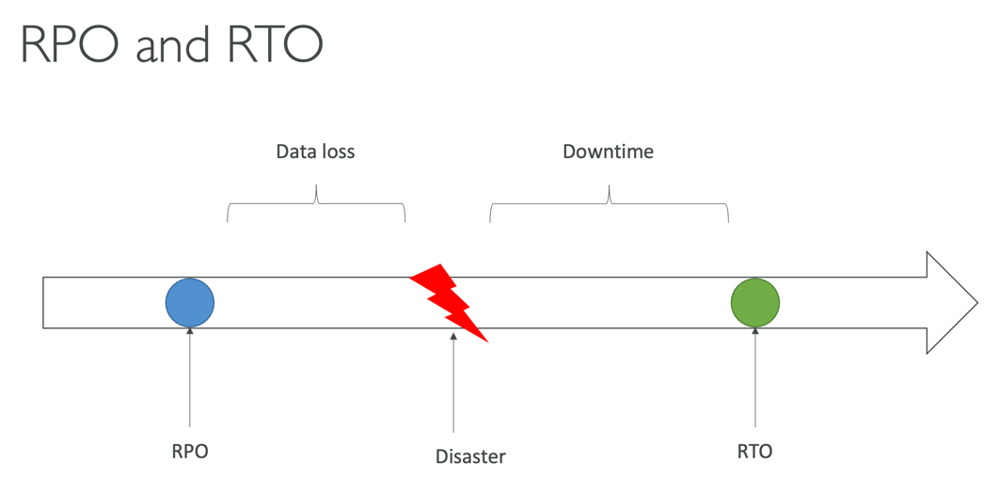
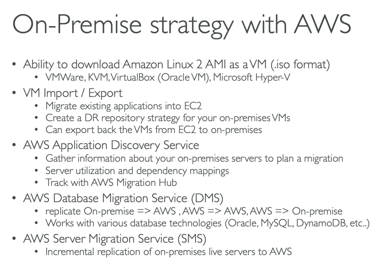

### DR
- DR 종류
  - On-premise -> on-premise : traditional DR
  - On-premise -> AWS : hybrid recovery
  - AWS -> AWS
- RPO : Recovery Point Objective
  - 시간상 어느 정도 과거로 되돌릴 수 있는가. 
  - 데이터를 매시간 백업한다면, 재해 발생한 시간 전의 백업 타임으로 백업할 수 있다. (그만큼 손싨도 있다.)
- RTO : Recovery Time Objective
  - 재해 발생 후 복구할 때 사용된다.
  - Disaster 로 부터 복구될 때 까지 걸리는 시간

- RPO, RTO 시간 간격이 짧을 수록 비용은 높아진다.

- Recovery Stategies
  - Backup and Restore (High RPO)
    - 백업, 복구는 아주 쉽고, 비요잉 저렴한데 , RPO, RTO 가 높다.
  - Pilot Light
    - Critical core
    - small version of the app is always running in the cloud
      - 백업 및 복구 전략과 매우 유사하지만 더 빠르다. (critical systems 이 항상 실행되기 때문)
    - 많이 사용되는 전략
  - Warm Standby
    - 최소한의 규모로 file system 을 실행하고 있다.
    - 스케일 다운된 버전의 시스템을 가동해, 재해가 발생하면 빠르게 스케일 업 하여 재해 복구 가능
  - Multi - Site / Hot Site Approach
    - active - active setup
    - RTO, RPO 모두 낮지만 비용이 많이 듬
    - Full production scale is running on both AWS and On-premise.

- for Backup
  - EBS Snapshots, RDS automated backups, Snapshots etc
  - Regular pushes to S3 / S3 IA / Glacier, Lifecycle Policy, CrossRegion Replication
  - From on-premise: snowball or Storage Gateway
- HA
  - Route53 을 이용해 DNS 를 타 region 으로 옮기면 매우 효과적
  - 기업이 데이터 센터를 AWS 로 연결할 때 Direct Connect 를 사용할 수도 있고, 연결이 끊어졌을 때를 대비하여 Site to Site VPN 을 설정할 수도 있다.(네트워크 복구 옵션)
- Replication
  - RDS replication
- Automation
  - cloudformation/ elastic beanstalk to re-create a whole new env
- Chaos
  - 넷플릭스는 simian-army 라는 것을 사용해 실제 운영중인 EC2 를 무작위로 종료한다고 한다. 
  - Chaos Monkey 를 사용해 재해 상황을 테스트하여, 더 단단한 아키텍쳐를 다진다. 
  - Chaos Monkey 나도 써보면 좋겠네.

### DMS : Database migration service
- quick, securely migrate DB to AWS, resilient, self-healing
- Source DB remains available during the migration
- Continuous Data replication using CDC
- Must create an EC2 instance to perform the replication task

### SCT (Scheme Conversion Tool)
- convert db's scheme from one engine to another
- 동일한 DB 엔진을 사용하는 경우의 마이그레이션 시에는 SCT 가 필요없다. 
- ex) ON-premise `PostgreSql` -> `RDS PostgreSql`

### RDS and Aurora Migrations
- External MySql to Aurora MySql
  - use percona XtraBackup to create a file backup in S3 from Mysql(on-premise or whatever)
  - create an Aurora MySql DB from S3

### On-premise Strategy With AWS

- 용어를 보고 당황하지 말고 온프레미스와 관련 있다는 것만 기억해두자. 

### AWS Backup
- 관리형 백업 서비스
  - 중앙 관리형이며 AWS Service 전반에 걸쳐 자동으로 백업한다.
  - 커스텀 스크립트나 프로세스 매뉴얼을 작성하거나 관리할 필요없다.
    - 대신 Backup Plans 라는 것을 작성함
  - 크로스-리젼 백업 및 크로스-어카운트 백업을 지원한다.
  - PITR (point in time recovery) 특정 시점으로 복구 지원

### AWS Backup Vault Lock
- 백업 데이터에 볼트 락을 지정하면, 백업을 지울 수 없게 방어막을 지정하는 것. 
- 루트 사용자 자신도 지울 수 없다. 

### MGN
- AWS Server Migration Service(SMS) 의 진화판 
- Converts your physical, virtual and cloud-based servers to run natively on AWS
- Supports wide range of platforms, OS, and DB
- minimal Downtime and reduced costs

### 대용량 데이터 셋을 AWS 로 전송
- 200TB data 를 100Mbs internet 으로 Cloud에 전송할 때
  1. Over the Internet / Site-to-Site VPN
    - 즉시 셋업 가능
    - 200TB * 1000GB * 1000MB * 8MB / 100Mbps = 185days 소요
  2. Over direct connect 1Gbps
     - Long for the one-time setup(1달 정도 소요)
  3. Over snowball (1회성)
     - 2, 3개의 스노우볼을 병렬로 배송받음
     - end-to-end 로 전송/배송하는데 1주일 정도 소요
  4. For on-going replication/ transfers 
     - Site-to-Site VPN
     - DX with DMS or Datasync

### vmware 기반 워크로드를 클라우드로 확장 가능
  - VMware Cloud 를 이용해 on-premise data center 를 운영하는 경우 존재
  - VMware cloud sw 를 사용하면서 Data center capacity 를 AWS 확장하고 싶을 떼,
  - VMware Cloud on AWS 서비스를 사용할 수 있다.

> Q. 재해 복구 계획의 일부로, AWS에서 중요한 인프라만을 가동해 실행하려 합니다. 복구 시간 목표(RTO)는 길어져도 상관이 없습니다. 이런 경우, 다음 중 어떤 DR 전략을 추천할 수 있을까요?
- 백업 및 복구
- 파일럿 라이트 (answer)
- Warm Standby
- 멀티 사이트

> Q. AWS DataSync가 지원하지 않는 로케이션을 고르세요.
- Amazon S3
- Amazon EBS (answer)
- Amazon EFS
- Windows 파일 서버 용 Amazon FSx

> Q. AWS DataSync가 지원하지 않는 로케이션을 고르세요.
- Amazon S3
- Amazon EBS (answer)
- Amazon EFS
- Windows 파일 서버 용 Amazon FSx

> Q. RDS, DynamoDB, Aurora, EFS 파일 시스템, EBS 볼륨과 같은 다양한 AWS 서비스 간의 백업을 자동화하려면 어떤 AWS 서비스를 사용해야 합니까?
- Amazon S3 수명 주기 정책
- AWS DataSync
- AWS Backup (answer)
- Amazon Glacier

