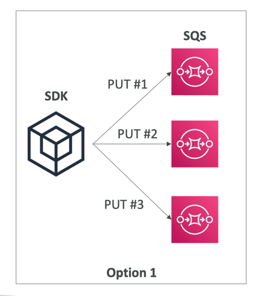
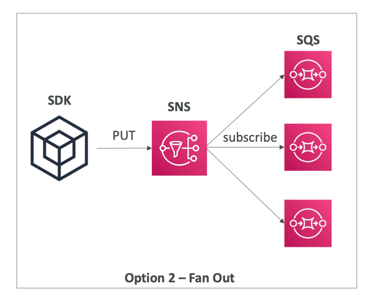
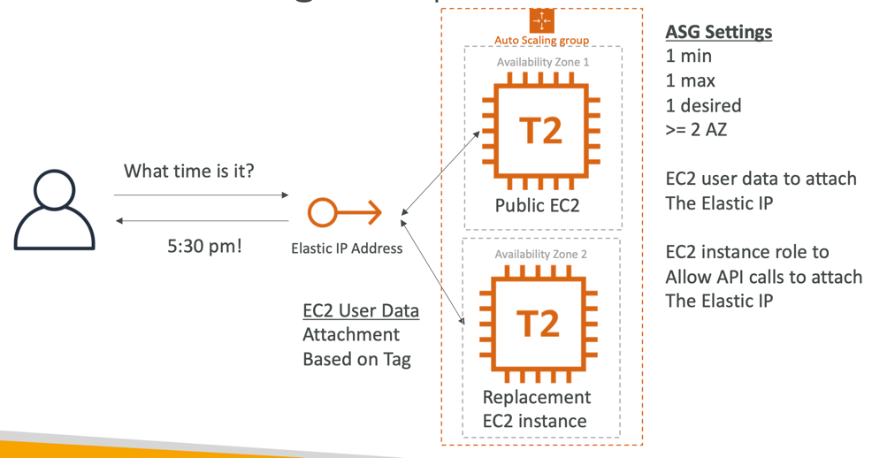

### Lambda, SNS, SQS
1. SQS + Lambda
- lambda 에서 SQS 의 메시지를 poll 
- 폴링 실패시 5번 시도 후 DLQ(Dead letter queue) 로 전송
- DLQ 는 SQS 측에 세팅됨

2. SQS FIFO + Lambda
- 위와 비슷하게 메시지 처리 but in FIFO way
- 마찬가지로 폴링 실패시 DLQ 로 전송

3. SNS + Lambda
- 람다에서 비동기로 메시지 폴링
- 메시지 전송 실패시 3번의 재시도후, 람다 측에 세팅된 DLQ로 전송
- SQS 에서 이를 받아 후에 처리하도록 세팅

### Fan out pattern : deliver to multiple SQS
- non fan out pattern

- 가령 두번째 SQS 에서 터지면, 세번째 SQS는 영영 메시지를 전송받지 못합.
- 안정적이지 않은 아키텍쳐

 
 

- fan out pattern

- 애플리케이션에서 SNS 로 메시지 전송
- multiple SQS 에서 SNS 의 이벤트 구독 (모든 SQS 가 메시지를 전송받는다) : Fan out pattern

### blocking an IP Address
- vpc 의 NACL 이 가장 첫번째 방어막으로, deny role 을 세팅하여 특정 IP를 튕겨낼 수 있다.
- 그 뒤의 Security Group 에서는 deny role 은 설정하지 못하고, 허용 규칙만 설정할 수 있다.
- 선택적으로 EC2의 방화벽을 설치해 블라킹 할 수도 있다.
- ALB 는 EC2와 연결을 종료할 수 있다.(원치 않는 트래픽에 대해?)

### HPC : High performance computing
- 클라우드는 고성능 컴퓨팅을 실행하기에 최적화된 환경임
- Direct Connect
  - move GB/s of data to the cloud, over a private secure network
- Snowball and snowmobile
  - move PB of data to the cloud
- AWS Datasync
  - Move `large amount` of data between 온프레미스 and S3, EFS, FSx for Windows.
- Compute Networking
  - EC2 instances
    - CPU /GPU optimized
    - Auto scaling
    - EC3 placement groups: Cluster for good network performance
  - EC2 Enhanced Networking (SR-IOV)
    - 더 높은 대역폭과, PBS, 낮은 지연시간
    - 아래 두 옵션으로 Enhanced networking 달성할 수 있다.
    - option 1. ENA (elastic network Adapter) : up to 100Gbps
    - option 2. Intel 82599 VF up to 10 Gbps - Legacy
  - Elastic Fabric Adapter (EFA)
    - Improved ENA for HPC, only works for linux. 
    - specially good for inter-node communications.
    - OS 를 우회하여 네트워크 성능을 높인다.
  - 시험에서는 ENA, EFA, ENI 의 차이를 자주 물어봄
- Automation and Orchestration
    - AWS Batch
    - AWS ParallelCluster

### Creating a Highly Available EC2 instance
- one elastic ip per one ec2 instance
- 하나의 ec2에서 장애 발생하면, cloudwatch 에서 이를 감지하여 람다에 알림
- 람다: start the instance attach the elastic IP
- elastic IP 가 붙어있던 기존 instance 는 다운 시키고, stand-by 하고 있던 새로운 instance 를 실행시켜 elastic IP 를 붙인다.
- 모두 뒷단에서 벌어지는 일이기에, 클라이언트는 어떤 일이 벌어지는지 모른다.

- 위 아키텍쳐는 cloudwatch 없이 ASG 자체 만으로 스케일링이 가능하다.

- EBS volume 은 하나의 리전에 락(lock) 돼 있다.
- 수명 주기 훅을 사용하여 하나의 인스턴스가 다운되면 EBS volume의 스냅샷을 찍어, 새로 인스턴스를 띄울 가용영역에 보낼 수 있다.

> Q. S3 버킷으로 업로드되는 객체를 처리하는 서버리스 애플리케이션으로 작업하고 있습니다. S3 버킷에 S3 이벤트를 구성해 객체가 업로드될 때마다 Lambda 함수가 호출되도록 만들었습니다. 프로세싱되지 않는 이벤트는 추후 처리를 위해 데드 레터 대기열(DLQ)로 전송시키려 합니다. 이런 경우, 다음 중 어떤 AWS 서비스를 선택해야 할까요?
- S3 이벤트
- SNS 주제
- Lambda 함수 (answer)
-> Lambda 함수의 호출은 ‘비동기적'이기 때문에, DLQ를 Lambda 함수 측에 설정해야 합니다.

> Q. 고성능 컴퓨팅(HPC)을 수행하기 위해 EC2 인스턴스를 클러스터 배치 그룹으로 배포했습니다. EC2 인스턴스들 간의 네트워크 성능을 최대화하려 합니다. 무엇을 사용해야 할까요?
- Elastic Fabric Adapter (answer)
- Elastic Network Interface
- Elastic Network Adapter
- FSx for Lustre

